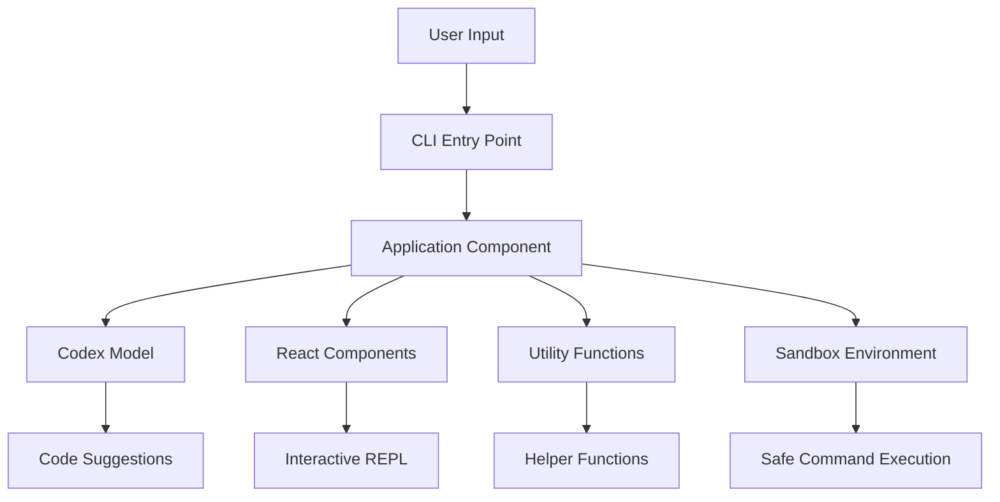

# Codex CLI Project Overview

## High-Level Description

The Codex CLI is a lightweight coding agent that runs in your terminal. It is designed to assist developers by automating coding tasks, providing code suggestions, and executing commands. The Codex CLI leverages the power of OpenAI's Codex model to understand and generate code, making it a valuable tool for developers looking to increase productivity and streamline their workflow.

### Main Features

- **Interactive REPL**: Provides an interactive Read-Eval-Print Loop (REPL) for coding tasks.
- **Auto-Approval Modes**: Offers different levels of autonomy for the coding agent, including suggest, auto-edit, and full-auto modes.
- **Sandboxed Execution**: Ensures safe execution of commands by running them in a sandboxed environment.
- **Multimodal Input**: Supports text and image inputs for more comprehensive coding assistance.
- **Project Documentation Integration**: Automatically includes project-specific documentation to provide context for coding tasks.

### Benefits for Business Users

- **Increased Productivity**: Automates repetitive coding tasks, allowing developers to focus on more complex and creative work.
- **Enhanced Collaboration**: Provides a consistent and reliable coding assistant that can be used by all team members.
- **Improved Code Quality**: Leverages advanced AI models to generate high-quality code suggestions and improvements.
- **Reduced Development Time**: Speeds up the development process by automating code generation and execution.

## System Architecture and Workflow

The Codex CLI follows a modular architecture, with each component responsible for a specific aspect of the system. The main components include:

1. **CLI Entry Point**: The main entry point for the Codex CLI, responsible for parsing user input and initializing the application.
2. **Application Component**: The core component that manages the overall workflow and interactions with the Codex model.
3. **React Components**: Used for rendering the interactive REPL and other user interface elements.
4. **Utility Functions**: Provide various helper functions and configurations for the Codex CLI.
5. **Sandbox Environment**: Ensures safe execution of commands by isolating them from the host system.

### Workflow Diagram



## Security Model and Permissions

The Codex CLI provides different approval modes to control the level of autonomy granted to the coding agent. These modes include:

- **Suggest Mode**: The agent can read any file in the repository but requires user approval for all file writes and shell commands.
- **Auto-Edit Mode**: The agent can read and apply-patch writes to files but still requires user approval for shell commands.
- **Full-Auto Mode**: The agent can read/write files and execute shell commands without user approval, but all commands are run in a sandboxed environment with network disabled and writes limited to the working directory.

### Sandboxing Details

- **macOS**: Uses Apple Seatbelt to create a read-only jail with limited writable roots and blocks outbound network access.
- **Linux**: Recommends using Docker for sandboxing, with a custom firewall script to block all egress except the OpenAI API.

## System Requirements and Installation

### System Requirements

- **Operating Systems**: macOS 12+, Ubuntu 20.04+/Debian 10+, or Windows 11 via WSL2
- **Node.js**: Version 22 or newer (LTS recommended)
- **Git**: Version 2.23+ (optional but recommended)
- **RAM**: Minimum 4 GB (8 GB recommended)

### Installation Instructions

1. **Install via npm**:
    ```shell
    npm install -g @openai/codex
    ```

2. **Set OpenAI API Key**:
    ```shell
    export OPENAI_API_KEY="your-api-key-here"
    ```

3. **Run Codex CLI**:
    ```shell
    codex
    ```

For more detailed instructions, refer to the [README.md](../README.md) file.
